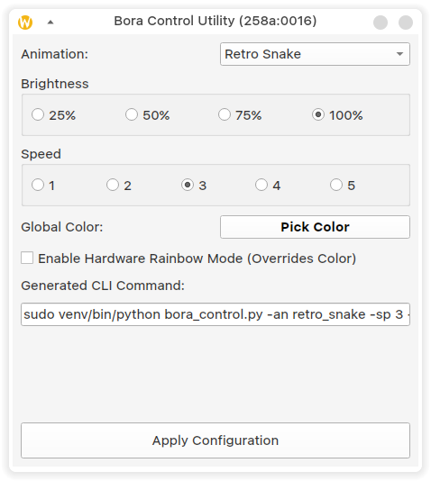

# Bora Control

A Python 3 utility and Graphical User Interface (GUI) to configure RGB profiles, animations, and settings for the **T-Dagger Bora TGK315-BL** mechanical keyboard on Linux.

> **Disclaimer:** This project was reverse-engineered, built, and tested **exclusively** on the T-Dagger Bora TGK315-BL. However, since it communicates with the underlying Sino Wealth microcontroller (VID `0x258a`), it may work out-of-the-box or with minor PID adaptations for other keyboards sharing the same chipset (such as Royal Kludge RK61, Redragon, and other T-Dagger models).

---

## 📸 Interface



---

## 🛠️ Features

- **Full GUI Support:** A PyQt6 based graphical interface for easy, point-and-click customization.
- **CLI Support:** Fully featured Command Line Interface for scripting and headless setups.
- **13 Built-in Animations:** Seamlessly switch between all hardware-supported lighting modes.
- **Speed & Brightness Control:** Complete reverse-engineered protocol allows independent speed and brightness settings for animations that support them.
- **Global Colors & Hardware Rainbow:** Switch between solid custom RGB colors or the hardware's built-in Rainbow mode.

## 📦 Dependencies

- Python 3
- `hidapi` (for USB communication)
- `PyQt6` (for the GUI)

Install the requirements via pip:

```bash
pip install hidapi PyQt6
```

> **Note:** To communicate with the USB HID device on Linux, you usually need root privileges (`sudo`) or custom `udev` rules.

## 🚀 How to Use

### Using the Graphical Interface (Recommended)

Run the GUI script with root privileges (if using Wayland, preserve the environment with `-E`):

```bash
sudo -E python bora_control_gui.py
```
*(If you are using a virtual environment, use `sudo -E venv/bin/python bora_control_gui.py`)*

### Using the Command Line (CLI)

You can also use the CLI utility directly for automation. 

```bash
sudo python bora_control.py <arguments>
```

**Arguments:**
- `--animation`, `-an`: Name of the animation (e.g., `retro_snake`, `neon_stream`, `steady`, etc.)
- `--speed`, `-sp [1-5]`: Speed of the LED animation.
- `--brightness`, `-br [1-4]`: Brightness of the LED animation (1 = 25%, 4 = 100%).
- `--red`, `-r [0-255]`: Red value of the global color.
- `--green`, `-g [0-255]`: Green value of the global color.
- `--blue`, `-b [0-255]`: Blue value of the global color.
- `--rainbow`, `-rb`: Enable hardware Rainbow Mode (Overrides static color).
- `--sleep`, `-sl [1-5]`: Sleep duration for the keyboard LEDs (1=5m, 2=10m, 3=20m, 4=30m, 5=Never).

**CLI Examples:**

Set a steady blue color:
```bash
sudo python bora_control.py -an steady -r 0 -g 0 -b 255
```

Set Retro Snake to max speed, 50% brightness, with Rainbow Mode enabled:
```bash
sudo python bora_control.py -an retro_snake -sp 5 -br 2 -rb
```

## ⌨️ Supported Animations
- `retro_snake`
- `neon_stream`
- `reaction`
- `sine_wave`
- `steady`
- `breathing`
- `rainbow`
- `flash_away`
- `raindrops`
- `rainbow_wheel`
- `ripples_shining`
- `stars_twinkle`
- `shadow_disappear`

---

### Acknowledgments
This project started as a fork of [oddlyspaced/rkcu](https://github.com/oddlyspaced/rkcu) (Royal Kludge Config Utility), heavily refactored to fully support the T-Dagger Bora architecture, including correct parameter bit-packing and GUI integration.

### AI Disclaimer
This project's refactoring, UI creation, and protocol reverse engineering were heavily assisted by AI (specifically, Google's DeepMind Antigravity). If you are allergic to AI-generated code, consider yourself warned. *Achoo!* 🤖🤧